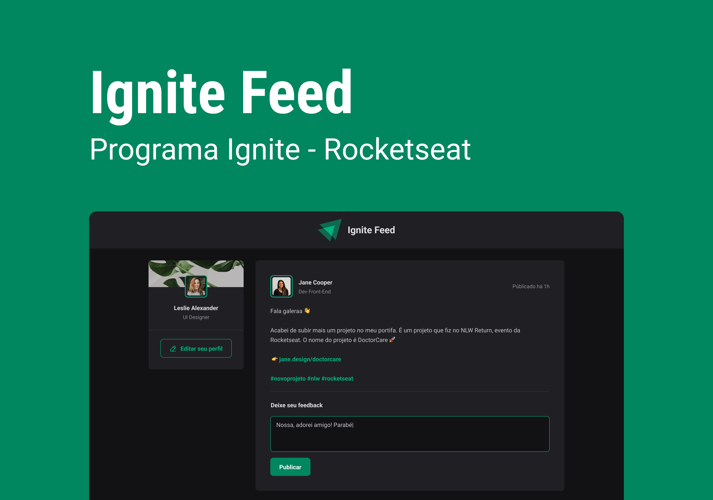

<h1 align='center'>💻Ignite Feed</h1>

  [Ferramentas](#ferramentas)
  |
  [Projeto](#projeto)
  |
  [Aprendizado](#aprendizado)
  |
  [designer](#designer)
  |
  [Licença](#licença)

  

  

## 🧰Ferramentas

Assim como foi usado no primeiro modulo do curso de react da 🔗[rocketSeat](https://app.rocketseat.com.br/events/nlw-unite/react/aula-01-react) fora aplicadas as mesmas ferramentas nesse projeto, sendo elas:

- react + vite
- typescript
- css modules

## 💻Projeto

O Projeto e uma pagina de interação de usuários com postes, podendo comentar e dar um gostei nos comentários.

Assim como dito anteriormente, esse projeto foi criado durante o primeiro mudulo do curso de react da 🔗[rocketSeat](https://app.rocketseat.com.br/events/nlw-unite/react/aula-01-react).

Para poder acessar o site clique aqui 🔗[deploy](https://matheus369k.github.io/ignite-feed/).

## 🚀Aprendizado

Durante a criação do projeto, pude aprender mais sobre a formatação de datas com o 🔗[date-fns](https://date-fns.org/). Sendo ela uma biblioteca, para manipular datas.

Também aprendi que ao criar uma aplicação e recomendado usar programação declarativa ao invés de imperativa, por facilitar a leitura do código, deixando-o menos verboso.

## 🎨designer

O designer do projeto, foi dado durante o curso.

Para pode acessa-lo no clique aqui 🔗[Figma](https://www.figma.com/design/GY53SWOQTVWGxnElEgvrun/Ignite-Feed-(Community)?node-id=68-296&t=SxFY5IT7IqKGKorK-1).

## 📜Licença

Fora usado a licença 🔗[MIT](/LICENSE.txt) no projeto.